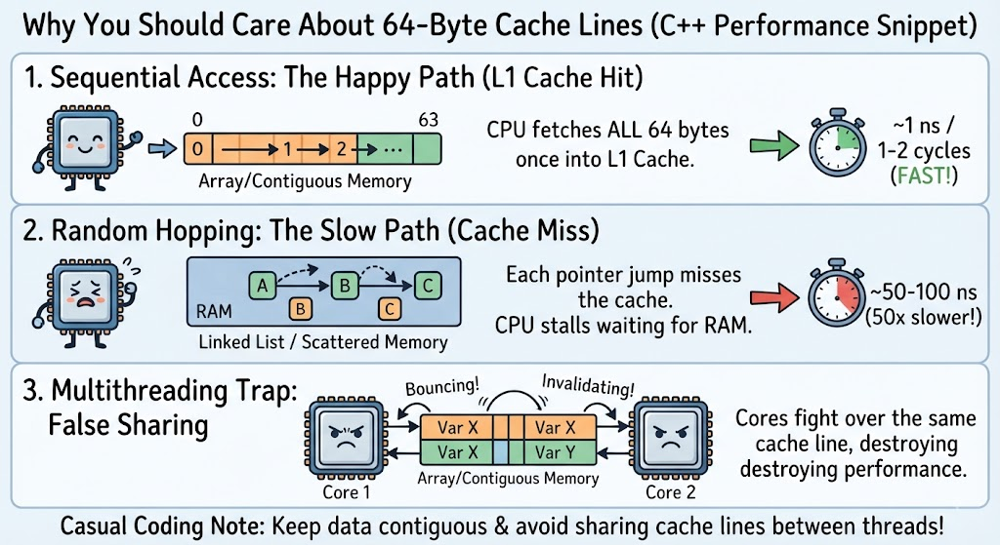

# Week 1 - Day 1: Computer Fundamentals + Shell



### ⚡ 64-Byte Cache Line Performance & Traps
- **Sequential Access (L1 Cache Hit ~1 ns):** Reading contiguous memory fetches 64-byte chunks instantly from L1 cache.
- **Pointer Hopping (Cache Miss Penalty ~50–100 ns):** Jumping across 64-byte boundaries forces CPU stalls to fetch main RAM.
- **False Sharing:** Concurrent threads modifying distinct variables on the same 64-byte line cause cache invalidation bouncing across cores.

---

## 📋 Objectives
- [x] CPU, RAM, storage, I/O, peripherals
- [x] Binary / Decimal / Hexadecimal basics
- [x] Instruction sets (ISA) and machine code concepts
- [x] Inspect Linux hardware with `lscpu`, `free`, `lsblk`, `lspci`
- [x] Build custom Hex Dumper (`hexdump.py`)

---

## 🗺️ Day 1 Pathways & Files

| File / Artifact | Description |
|---|---|
| 🧠 [**`my-take.md`**](my-take.md) | My personal mental model, notes, synthesis, and takeaways written during study. |
| 🤖 [**`learning-materials/ai-summary.md`**](learning-materials/ai-summary.md) | Formal technical reference & architectural summary of all Day 1 concepts. |
| 📚 [**`learning-materials/theory-and-docs.md`**](learning-materials/theory-and-docs.md) | Raw textbook theory, Linux command guides, and deep-dive technical Q&A. |
| 🛠️ [**`learning-materials/hexdump.py`**](learning-materials/hexdump.py) | Custom Python hex dumper tool written for the Day 1 capstone. |

---

## 🔬 Practical Lab & Inspection Commands

```bash
# CPU Architecture & Cache Line Inspection
lscpu

# RAM Capacity & Buffer/Cache Allocation
free -h

# Block Storage Partitions
lsblk

# Memory-Mapped I/O (MMIO) PCI Devices
lspci -v
```

---

## 📝 Obsidian Vault Link
- **Concept Note:** `[[Computer Architecture Primitives]]` in `Engineers-Playbook/02 Permanent/`
