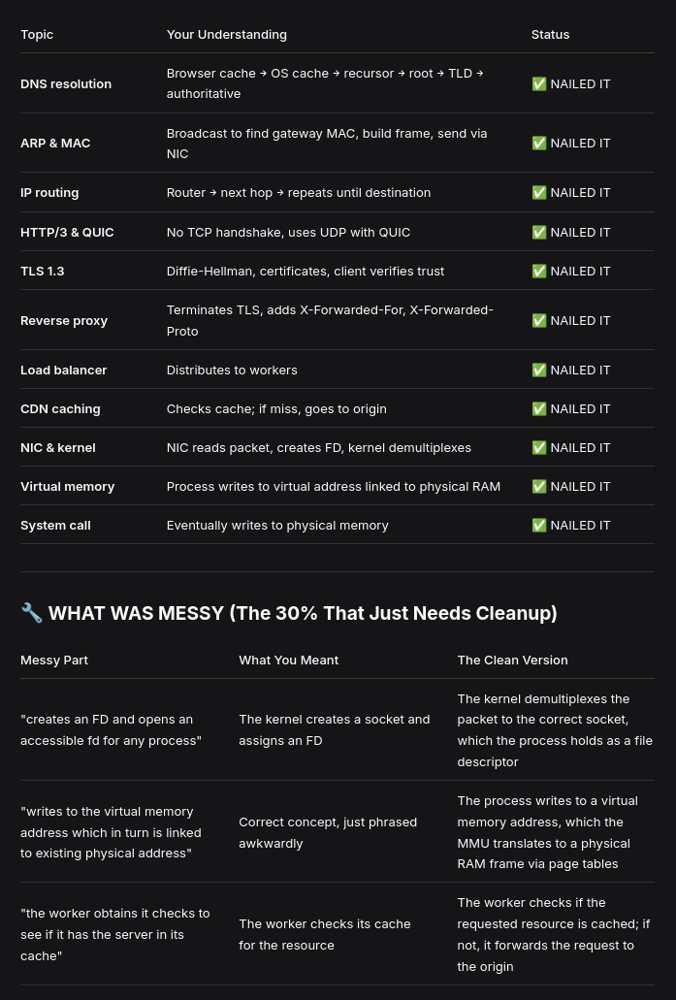

To send a packet to the server, my laptop's first step is to obtain the server's IP address. It first checks the browser cache and OS cache; if they don't have it, it sends a DNS query to its DNS recursor, which traverses the root and TLD servers, then asks the authoritative DNS servers to return the IP address.

With the IP in hand, the OS then checks if the destination is on the same local network. Since it isn't, it sends an ARP broadcast to find the MAC address of its default gateway (the router). Once it has the gateway's MAC, it constructs the Ethernet frame and sends the packet out through its NIC. The router receives it, looks up the next hop in its routing table, re-encapsulates the packet, and forwards it. This repeats hop by hop until the packet reaches the edge CDN.

The CDN's reverse proxy terminates the TLS 1.3 connection: it presents its certificate, completes the ECDHE key exchange with the client, and verifies the certificate chain using the root CA stored in the client's OS. Once the secure connection is established, the client sends its HTTP/3 request over QUIC (no TCP handshake needed). The reverse proxy modifies the headers (adding X-Forwarded-For and X-Forwarded-Proto) and forwards the request to the load balancer.

The load balancer picks an available origin server and forwards the request. If the origin server is fronted by another reverse proxy, that proxy may use its established TLS connection to the Frankfurt server (often amortized across many requests) to forward the request.

At the Frankfurt server, the NIC receives the packet, copies it into kernel memory via DMA, and raises an interrupt. The kernel's network stack processes the packet, demultiplexes it to the correct socket using the (IP, port) tuple, and hands it to the associated file descriptor. The listening process reads the request into its user-space buffer—a virtual memory address backed by physical RAM via the MMU and page tables. The application then modifies the variable (e.g., balance -= 5000). This write first lands in the CPU cache and user-space buffer; eventually, the kernel flushes it to physical memory (and possibly to disk via a system call like write() or fsync()). The server then crafts a response, encrypts it, and sends it back through the reverse proxy and CDN to the client.

